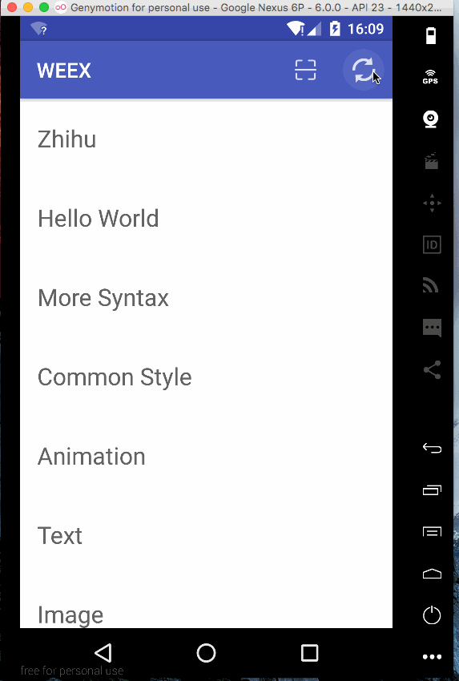

# XiaoxiaZhihuWeex

---

参考知乎日报，使用网络上的[Api](https://github.com/izzyleung/ZhihuDailyPurify/wiki/%E7%9F%A5%E4%B9%8E%E6%97%A5%E6%8A%A5-API-%E5%88%86%E6%9E%90)，仿写了一个知乎日报客户端。

由于使用非正常手段获取Api，若被告知需停止共享与使用，本人会及时删除此页面与整个项目。

客户端使用Alibaba开源的Weex进行开发。

## 其他客户端

[XiaoxiaZhihu iOS客户端](https://github.com/LiushuiXiaoxia/XiaoxiaZhihu_iOS)

[XiaoxiaZhihu Android客户端Java版本](https://github.com/LiushuiXiaoxia/XiaoxiaZhihu)

[XiaoxiaZhihu Android客户端Kotlin版本](https://github.com/LiushuiXiaoxia/XiaoxiaZhihu_Kotlin)

[XiaoxiaZhihu Android客户端ReactNative版本](https://github.com/LiushuiXiaoxia/XiaoxiaZhihuRN)

[XiaoxiaZhihu Android客户端Weex版本](https://github.com/LiushuiXiaoxia/XiaoxiaZhihuWeex)

## 效果图



## 使用

下载Weex源码，复制本项目中zhihu文件夹到weexexas目录中，然后修改examples/index.we文件。

根据index.we中的示例，然后添加如下代码，然后运行playground即可。

```js
{name: 'zhihu/main', title: 'Zhihu'},
```

## 总结

Weex还有很多不足之处，比如不支持直接显示html文本、文本中不能包含表情，否则会奔溃。所以在知乎日报中的详情页面直接以webview的形式打开一个网页。
同样一份代码，在iOS、Android、H5上面运行效果很不一样，而且兼容困难，与所宣传的有所差异。

## 后续

* 等待Weex成熟以后再行优化。